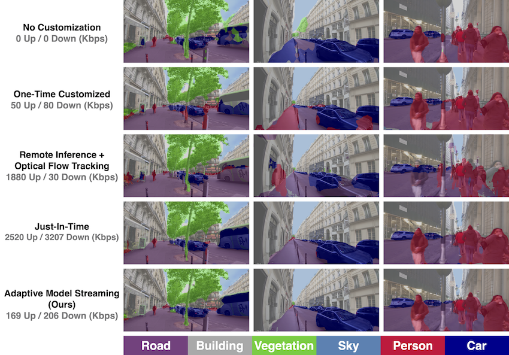

# Real-Time Video Inference on Edge Devices via Adaptive Model Streaming

## Table of Contents
- [Installation](#installation)
- [Running AMS](#running-ams)
- [Models & Checkpoints](#models-&-checkpoints)
- [Datasets](#datasets)
- [References](#references)

## Installation
For installing the required packages using [Conda](https://conda.io/projects/conda/en/latest/user-guide/install/index.html), use:
```
git clone https://github.com/modelstreaming/ams.git
cd ams
conda env create -f environment.yml
```
The current version relies on `tensorflow-v1` for the training and inference purposes. 

## Running AMS
For running the code, use:
```
conda activate ams
python run.py --help
```

## Models & Checkpoints
### Student
For lightweight (student) models we use DeeplabV3 with MobileNetV2 backbone. We use official pretrained checkpoints released in Deeplab's github repo [here](https://github.com/tensorflow/models/tree/master/research/deeplab/g3doc/model_zoo.md). For compatibilty with `TF1` and our code, you may directly use the following checkpoints:
- [DeeplabV3 with MobileNetV2 backbone pretrained on Cityscapes](./checkpoints/deeplabv3_mobilenetv2_cityscapes)
- [DeeplabV3 with MobileNetV2 backbone pretrained on PASCAL VOC 2012](./checkpoints/deeplabv3_mobilenetv2_pascalvoc2012)

### Teacher
For the teacher model, we use DeeplabV3 with Xception65 backbone for Outdoor Scenes, Cityscapes, and A2D2 datasets. For a compatible teacher checkpoint, use:
- [DeeplabV3 with Xception65 backbone pretrained on Cityscapes](./checkpoints/deeplabv3_xception65_cityscapes)

For the LVS dataset, we follow Mullapedi et al. [3] in using Mask R-CNN as the teacher and directly use the teacher labels they provide.

## Datasets
### Outdoor Scenes
The Outdoor Scenes video dataset that we introduce includes seven publicly available videos from Youtube, with 7-15 minutes in duration. These videos span different levels of scene variability and were captured with four types of cameras: Stationary, Phone, Headcam, and DashCam.  For each video, we manually select 5-7 classes that are detected frequently by our best semantic segmentation model (DeeplabV3 with Xception65 backbone trained on Cityscapes data) at full resolution.

| Video | Link | Time Interval (min:sec) |
| --- | --- | --- |
|Interview | https://www.youtube.com/watch?v=zkIADOEhk5I | 00:20 - 07:25 |
|Dance recording | https://www.youtube.com/watch?v=2mtaoDYcisY | 00:06 - 15:20 | 
|Street comedian | https://www.youtube.com/watch?v=1ESzHVhAKBI | 00:00 - 13:55 | 
|Walking in Paris | https://www.youtube.com/watch?v=09oFgM5IHSI | 12:37 - 27:51 | 
|Walking in NYC | https://www.youtube.com/watch?v=H_zosklgz18 | 100:40 - 115:43 |
|Driving in LA | https://www.youtube.com/watch?v=Cw0d-nqSNE8 | 08:24 - 23:38 |
|Running | https://www.youtube.com/watch?v=S9xzNyi_5TI | 16:21 - 29:56 |

### Cityscapes
We use the entire Frankfurt unlabeled long video sequence from the Cityscapes dataset [1]. You can download this video [here](https://www.cityscapes-dataset.com/file-handling/?packageID=27).

### A2D2
We use the entire video sequence of front center cameras at [Gaimersheim](https://aev-autonomous-driving-dataset.s3.eu-central-1.amazonaws.com/camera_lidar-20180810150607_camera_frontcenter.tar), [Ingolstadt](https://aev-autonomous-driving-dataset.s3.eu-central-1.amazonaws.com/camera_lidar-20190401145936_camera_frontcenter.tar), and [Munich](https://aev-autonomous-driving-dataset.s3.eu-central-1.amazonaws.com/camera_lidar-20190401121727_camera_frontcenter.tar) from the Audi Autonomous Driving Dataset (A2D2) [2].

### LVS
For downloading the Long Videos Dataset (LVS) [1], you may check [here](http://graphics.cs.cmu.edu/projects/lvsdataset/).

## References
1. Cordts, M., Omran, M., Ramos, S., Rehfeld, T., Enzweiler, M., Benenson, R., Franke, U., Roth, S. and Schiele, B., 2016. The cityscapes dataset for semantic urban scene understanding. In Proceedings of the IEEE conference on computer vision and pattern recognition (pp. 3213-3223).
2. Geyer, J., Kassahun, Y., Mahmudi, M., Ricou, X., Durgesh, R., Chung, A.S., Hauswald, L., Pham, V.H., Mühlegg, M., Dorn, S. and Fernandez, T., 2020. A2d2: Audi autonomous driving dataset. arXiv preprint arXiv:2004.06320.
3. Mullapudi, R.T., Chen, S., Zhang, K., Ramanan, D. and Fatahalian, K., 2019. Online model distillation for efficient video inference. In Proceedings of the IEEE/CVF International Conference on Computer Vision (pp. 3573-3582).
